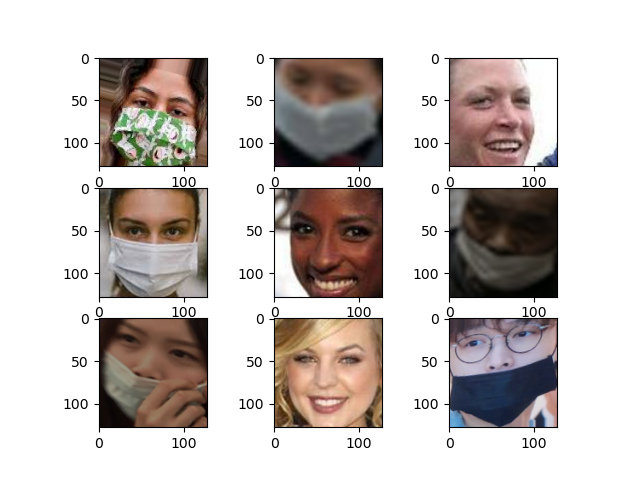

# Facemask Detection Database

La base de datos que se utiliza en este experimento se encuentra en Kaggle (https://www.kaggle.com/datasets/vijaykumar1799/face-mask-detection). Es una recopilación de varias bases de datos donde existen tres tipos de imágenes distintas. 

1. Sin máscara.
2. Con máscara.
3. Con máscara pero mal colocada.

Las imágenes son de 128x128 pixeles en formato RGB (Red, Green, Blue). Un ejemplo de una imagen se muestra a continuación.



## Preprocesamiento de las imágenes

El preprocesamiento de estas imágenes consiste en leer cada una de estas y guardarla en un tensor para su posterior uso junto a un algoritmo de clasificación.

Los pasos son los siguientes:

1. Descargar la base de datos de la página de Kaggle.
2. Descomprimir en una carpeta en la computadora.
Las los siguientes directorios y archivos deben quedar en una misma carpeta
- mask_weared_incorrect
- without_mask
- with_mask
- image_preprocessing.py

3. Ejecutar el *script* image_preprocessing.py. Este *script* genererá un objeto del tipo PKL, el cual ya tiene separadas los datos en entrenamiento y prueba. Si desea modificar el porcentaje de imágenes de entrenamiento se necesita modificar este *script*.
4. Leer las imágenes es muy sencillo, simplemente ejecute el siguiente código en su rutina.

```python
import joblib 

train_images, test_images, train_labels, test_labels = joblib.load("facemask_dataset.pkl")
```


